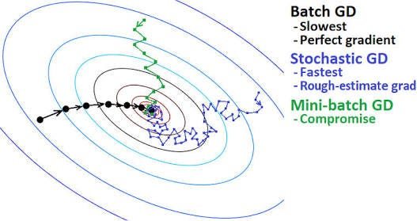
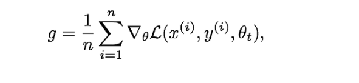
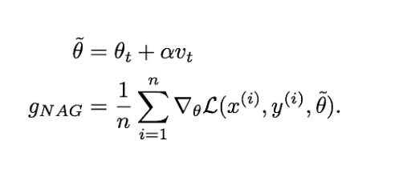
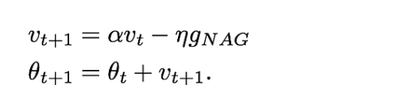

# Possible Questions

## 1) What are the differences in terms of the number of updates to model parameters during 10 epochs when using stochastic gradient descent (SGD), mini-batch gradient descent, and batch gradient descent, and how does the choice of algorithm impact the training process over these 10 epochs?

<!--  make it bold -->
 #### Batch Gradient Descent:( vanilla gradient descent )

-> In batch gradient descent, the entire training dataset is used to compute the gradient of the cost function with respect to the model parameters. 

-> The model parameters are updated once per epoch (a full pass through the entire training dataset). 

-> 10 epochs -10 times parameter update - so we use to calculate the average gradient(for each parameter) over one complete epoch and then finally made change to the parameter 

#### Stochastic Gradient Descent (SGD):

-> In stochastic gradient descent, the model parameters are updated after each individual training example.
it's called "stochastic" because the updates are noisy and can fluctuate based on the randomness inherent in using individual data points.    

-> 10 epoch- X.size()*(10)

#### Mini-Batch Gradient Descent:

-> Mini-batch gradient descent strikes a balance between batch and stochastic gradient descent. It divides the training dataset into small batches (typically of size 32, 64, 128, etc.), and the model parameters are updated after processing each mini-batch.  

-> 10 epochs - (x.size()/batch_size)*10

## 2) why does stochastic gradient has high variance?

#### Noisy Updates:

SGD computes the gradient and updates the model parameters for each individual training example. Since each example is a small, random sample from the entire dataset, the updates can be noisy and fluctuate significantly. This noise introduces variance in the optimization process.

#### Randomness in Data Ordering:

The order in which training examples are presented to the algorithm is typically randomized in each epoch. This random ordering introduces additional variability in the updates, as the model parameters are adjusted based on different subsets of the data in each epoch.

#### Impact of Outliers:

Individual training examples, especially outliers, can have a more pronounced effect on the updates in SGD. If a particular example has an unusually large gradient, it can lead to a substantial update in the model parameters, introducing variance in the optimization process.

#### Convergence Path Fluctuations:

The path taken by the optimization algorithm to reach the minimum of the cost function can vary between different runs due to the random selection of individual examples. This variability in the convergence path contributes to the overall high variance.

## What are some condition that even Stochastic Gradient Descent can become very slow and describe the solution to it?

### Common Issues and Solutions in Stochastic Gradient Descent (SGD)

#### Noisy Gradients:

**Issue:**
If the gradients of the loss function are noisy or have high variance, the model parameters can oscillate, leading to slow convergence.

**Solution:**
Use techniques like mini-batch gradient descent, which computes gradients based on a small subset of data points. This can help reduce the impact of noisy gradients.

#### Poorly Chosen Learning Rate:

**Issue:**
A learning rate that is too high can cause SGD to overshoot the minimum, leading to divergence. A learning rate that is too low can result in slow convergence.

**Solution:**
Experiment with different learning rates. Techniques like learning rate schedules, adaptive learning rates (e.g., Adam optimizer), or implementing early stopping can help find an appropriate learning rate.

#### Poorly Conditioned Cost Function:

**Issue:**
If the cost function has poor conditioning (e.g., elongated valleys), SGD may struggle to navigate and converge slowly.

**Solution:**
Apply techniques like feature scaling or use preconditioning methods to transform the problem into a better-conditioned space.

#### Vanishing or Exploding Gradients:

**Issue:**
In deep neural networks, gradients may become too small (vanishing) or too large (exploding), leading to slow convergence or divergence.

**Solution:**
Implement gradient clipping to prevent exploding gradients and use appropriate weight initialization techniques (e.g., Xavier/Glorot initialization) to mitigate vanishing gradients.

#### Saddle Points:

**Issue:**
In high-dimensional spaces, SGD may get stuck in saddle points, where gradients are near zero but not at a minimum.

**Solution:**
Implement techniques like momentum-based methods, which can help SGD escape saddle points.

## Nestov vs Momentum based Gradient descent?
The difference between Momentum method and Nesterov Accelerated Gradient is in gradient computation phase. In Momentum method, the gradient was computed using current parameters θ𝑡

whereas in Nesterov Accelerated Gradient, we apply the velocity vt to the parameters θ to compute interim parameters θ̃ . We then compute the gradient using the interim parameters

In Nesterov Accelerated Gradient case, you can view it like peeking through the interim parameters where the added velocity will lead the parameters. If the velocity update leads to bad loss, then the gradients will direct the update back towards θ𝑡.This help Nesterov Accelerated Gradient to avoid the oscillations and dodge the exploding gradient issue/Overshooting.