## Why do newton method do not need learning rate?
The use of the derivative in the update formula helps the algorithm to converge more quickly towards the root. When the derivative is large, the update is more substantial; when it is small, the update is smaller. This adaptive nature of the update, based on local information provided by the derivative, eliminates the need for a separate learning rate.

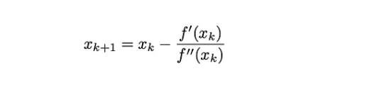

## 1) Newton method for calulcation the minima worls faster then why we dont use it instead of stocastic(Vanilla) Gradient descent

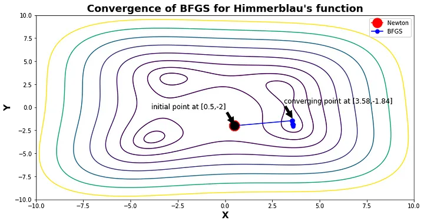

__Highly sensitive to initial conditions__
 -> See in the above image : Here the Newton’s method fails to converge(as shown by the red dot) to the minima when the starting point is (0.5, -2) but BFGS (a mystery method for now) converges to one of the minima successfully. It is therefore difficult to choose the intial points so that the Newton’s method converges. Especially true for a non-convex model would be neural networks. For the rest of this article, we will restrict our attention to only convex objective functions.

__Positive Definite Hessian__

    -> if the hessian is not positive definite the update may increase the objective function value.Correspondingly, we require the Hessian to be positive definite.
__Computationally expensive__

   As the dimensions of our problem increases, the overhead in memory and time gets out of hand very quickly. For example, in 50 dimensions, we’ll have to calculate 50(50+1)/2 = 1275 values for the Hessian at each step, and then perform approximately another (53*2500) operations to invert it. It’s clear at this point that the benefit of an increased convergence rate will be far outweighed by the large cost of the additional computation time. (computing the Hessian scales as O(n²), inverting it scales as O(n³))

### Newton Method?

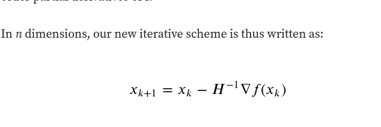

### Quasi-Newton Method?

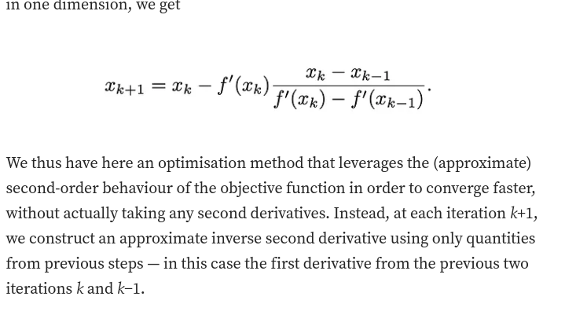

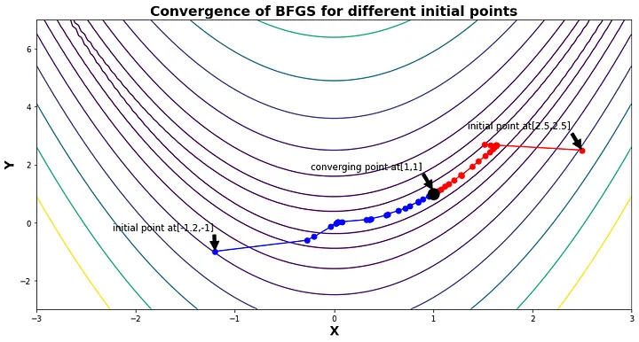

## why we do not use quasi newton method rather than stocastic gradient descent?

#### Memory Requirements:

- Quasi-Newton methods, like BFGS, maintain an approximation of the Hessian matrix, which can be computationally expensive in terms of memory.
- In SGD, each update is based on a small subset of data, and maintaining the full Hessian matrix may not be practical due to the potentially large dataset size.

#### Computational Complexity:

- Quasi-Newton methods involve the inversion of the Hessian matrix or its approximation, which has a cubic time complexity in the number of parameters.
- In the context of deep learning, neural networks often have a large number of parameters, making the computational cost of these methods prohibitive, especially for online learning scenarios.

#### Stochastic Nature of SGD:

- The stochastic nature of SGD, where gradients are computed on small random subsets of data, introduces noise into the optimization process.
- The assumptions made by quasi-Newton methods about smooth and deterministic gradients are violated in the stochastic setting, potentially leading to suboptimal performance.

#### Adaptability to Online Learning:

- Quasi-Newton methods are designed for batch optimization, where the entire dataset is available at each iteration.
- SGD is well-suited for online learning scenarios, where data arrives sequentially or in mini-batches, making it more adaptable to real-time updates and large-scale datasets.

#### Regularization Techniques:

- Modern deep learning often involves the use of regularization techniques, such as dropout or weight decay, which can affect the curvature of the loss landscape.
- The effectiveness of quasi-Newton methods relies on certain smoothness assumptions that may not hold in the presence of regularization.

## How quasi newton reduce the computation than newton method?

In quasi-Newton methods, instead of computing the actual Hessian, we just approximate it with a positive definite matrix B, which is updated from iteration to iteration using information computed from previous steps (we require B to be positive definite because we are optimising a convex function, and this automatically takes care of the symmetry requirement of the Hessian).We immediately see that this scheme would yield a much less costly algorithm compared to Newton’s method, because instead of computing a large amount of new quantities at each iteration, we’re largely making use of previously computed quantities.

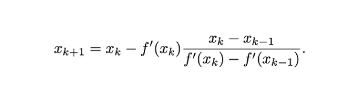

## What is adagrad?
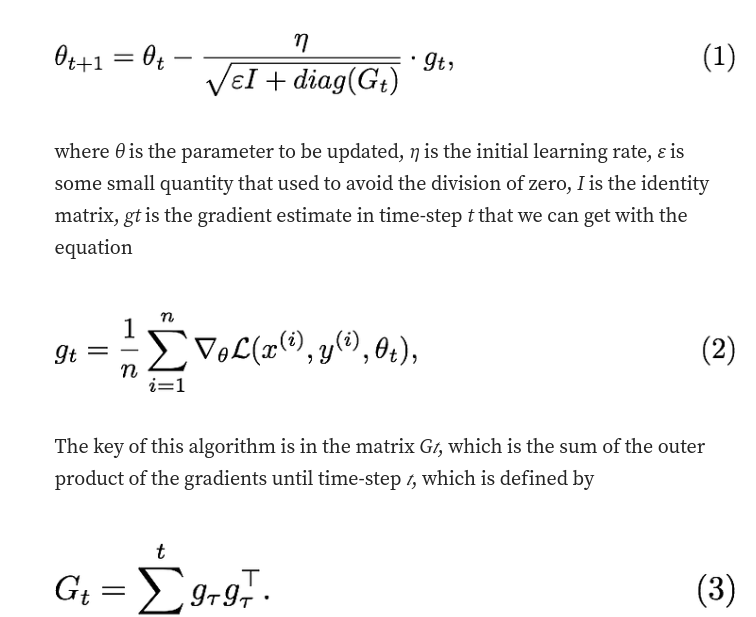

Adagrad is different from stocastic gradient descent

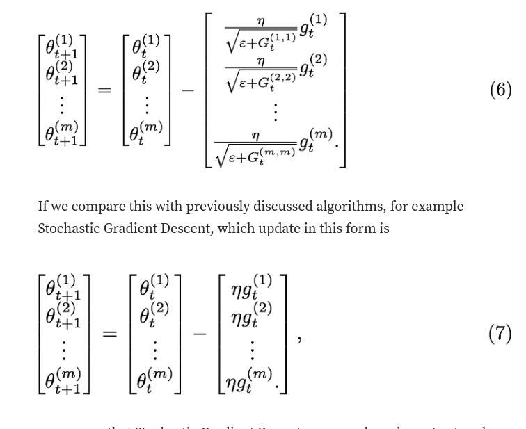

we can see that Stochastic Gradient Decent use same learning rate at each iteration in all dimension. On the other hand, AdaGrad adaptively scaled the learning rate with respect to the accumulated squared gradient at each iteration in each dimension.

After soem modification it converts to 

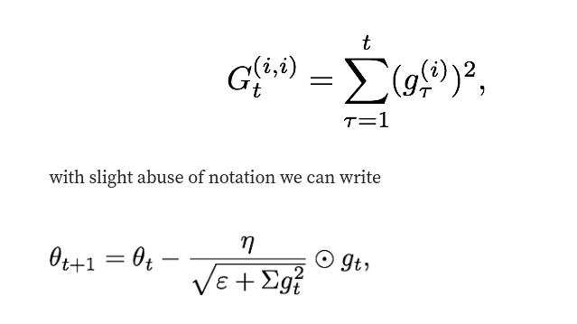

## Why adagrad performs well on Sparse Data(where many features have zero values)?

#### Adagrad and Sparse Data

In the context of sparse data, where many features have zero values, using a fixed learning rate for all parameters may not be the most efficient approach. Some features may have more frequent updates and need a smaller learning rate to avoid overshooting, while others may be updated infrequently and can benefit from a larger learning rate.

Adagrad addresses this challenge by adapting the learning rates for each parameter individually. This is achieved by maintaining a separate learning rate for each feature based on the historical gradient information. Here's a simplified explanation of how Adagrad works:

__Accumulating Squared Gradients__
Adagrad maintains a __sum__ of the squares of __past gradients__ for __each parameter.__

__Adaptive Learning Rates__
The learning rate for each parameter is adjusted based on the historical gradient information. Parameters associated with frequently occurring features get a smaller effective learning rate, while those associated with infrequently occurring features get a larger effective learning rate.

__For Sparse Data:__
- Features that are more sparse (occur less frequently) will have their accumulated squared gradients increase more slowly, resulting in a relatively larger effective learning rate.
- Features that are less sparse (occur more frequently) will have their accumulated squared gradients increase more quickly, resulting in a relatively smaller effective learning rate.

Adagrad's adaptability in adjusting learning rates makes it particularly effective in handling sparse data scenarios.

## What are the scenarios when adagrad does not wwork well?
Adagrad got stuck because of aggressive behavior
near the convergence(rapiddly dimnishing learning rate).RMSProp solve this problem by being less aggressive on the decay.

### Adagrad Drawbacks

__Learning Rate Decay__

   Adagrad utilizes an adaptive learning rate mechanism, but the accumulated squared gradients can become very large over time. Consequently, the learning rates for some parameters may decay too aggressively, leading to very small effective learning rates in the later stages of training. This can significantly slow down the learning process.

__Monotonically Decreasing Learning Rate__

    The accumulation of squared gradients is monotonic, causing the learning rate to decrease over time. In some cases, this monotonically decreasing learning rate may become too small, hindering the model's ability to make further updates, especially in later stages of training.

__Memory Requirements__

Adagrad accumulates the squared gradients for each parameter, resulting in increased memory requirements. This can be a significant limitation, particularly when dealing with large datasets or high-dimensional feature spaces, and may pose challenges in scenarios where memory resources are constrained.

__Not Suitable for Non-Convex Optimization__

Adagrad's adaptive learning rate approach may not be well-suited for non-convex optimization problems. In non-convex scenarios, the adaptive learning rates can lead to oscillations or convergence to suboptimal solutions.

__Sensitivity to Initial Learning Rate__

The performance of Adagrad can be sensitive to the choice of the initial learning rate. If the initial learning rate is set too high, it may result in large updates early in training, potentially causing convergence issues.

These limitations highlight scenarios where caution or alternative optimization algorithms may be warranted.

## What is rprop and its working?
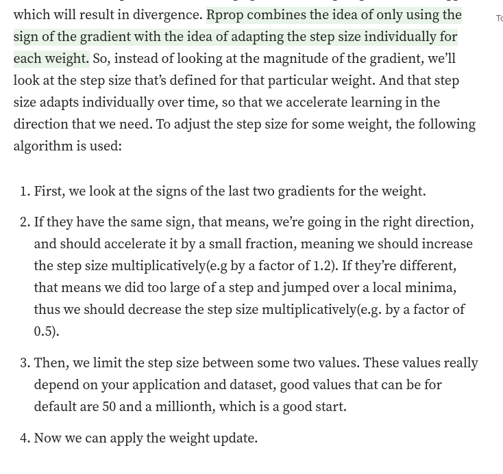

## Where will Rprop fail?
Rprop doesn’t really work when we have very large datasets and need to perform mini-batch weights updates. Why it doesn’t work with mini-batches ? Well, people have tried it, but found it hard to make it work. The reason it doesn’t work is that it violates the central idea behind stochastic gradient descent, which is when we have small enough learning rate, it averages the gradients over successive mini-batches. Consider the weight, that gets the gradient 0.1 on nine mini-batches, and the gradient of -0.9 on tenths mini-batch. What we’d like is to those gradients to roughly cancel each other out, so that the stay approximately the same. But it’s not what happens with rprop. With rprop, we increment the weight 9 times and decrement only once, so the weight grows much larger.

To combine the robustness of rprop (by just using sign of the gradient), efficiency we get from mini-batches, and averaging over mini-batches which allows to combine gradients in the right way, we must look at rprop from different perspective. 

## Describe the idea behind Rmsprop?
Rprop is equivalent of using the gradient but also dividing by the size of the gradient, so we get the same magnitude no matter how big a small that particular gradient is. The problem with mini-batches is that we divide by different gradient every time, so why not force the number we divide by to be similar for adjacent mini-batches ? The central idea of __RMSprop is keep the moving average of the squared gradients for each weight__. And then we divide the gradient by square root the mean square. Which is why it’s called RMSprop(root mean square). With math equations the update rule looks like this:

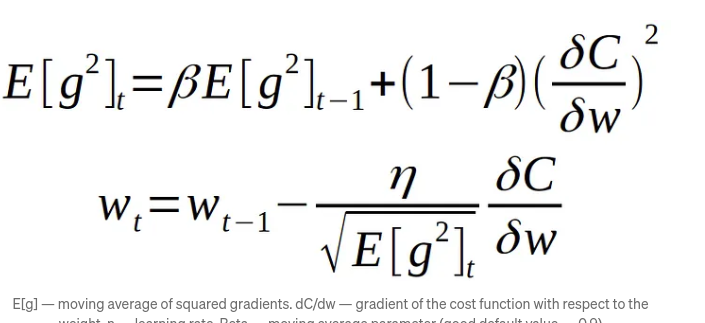
As you can see from the above equation we adapt learning rate by dividing by the root of squared gradient, but since we only have the estimate of the gradient on the current mini-batch, wee need instead to use the moving average of it. Default value for the moving average parameter that you can use in your projects is 0.9. 

#### __Algos without scaling based on gradient information really struggle to break symmetry here - SGD gets no where and Nesterov Accelerated Gradient / Momentum exhibits oscillations until they build up velocity in the optimization direction.__

#### __Due to the large initial gradient, velocity based techniques shoot off and bounce around - adagrad almost goes unstable for the same reason.Algos that scale gradients/step sizes like adadelta and RMSProp proceed more like accelerated SGD and handle large gradients with more stability.__

####  __Behavior around a saddle point.NAG/Momentum again like to explore around, almost taking a different path.Adadelta/Adagrad/RMSProp proceed like accelerated SGD.__

##  What are the Drawbacks of RMSprop and how adam solves them?

### Learning Rate Decay

#### RMSprop:
RMSprop adapts learning rates based on the moving average of squared gradients. However, it lacks a per-parameter adaptive learning rate mechanism.

#### Adam:
Adam incorporates momentum and an adaptive learning rate. It utilizes moving averages of both gradients and squared gradients, addressing the issue of aggressive learning rate decay.

### Bias Correction

### RMSprop:
The accumulated squared gradients in RMSprop can lead to biased estimates of second-order moments, particularly in the initial training steps.

### Adam:
Adam introduces bias correction terms for the first and second moments, reducing bias towards zero during early training steps.

#### Lack of Momentum

### RMSprop:
RMSprop lacks a momentum term, which could assist in navigating flat regions and escaping local minima more effectively.

### Adam:
Adam includes a momentum term similar to SGD with momentum, aiding optimization, especially in the presence of noisy gradients.

## Sensitivity to Hyperparameters

### RMSprop:
RMSprop requires careful tuning of hyperparameters, including the learning rate.

### Adam:
While less sensitive than RMSprop, Adam still requires hyperparameter tuning. Common choices include values for the learning rate, momentum term, and decay rates.

## Improved Handling of Sparse Gradients

### Adam:
Adam has been shown to perform well with sparse gradients, making it suitable for tasks with large and sparse datasets.

## Adagrad vs Rmsprop?

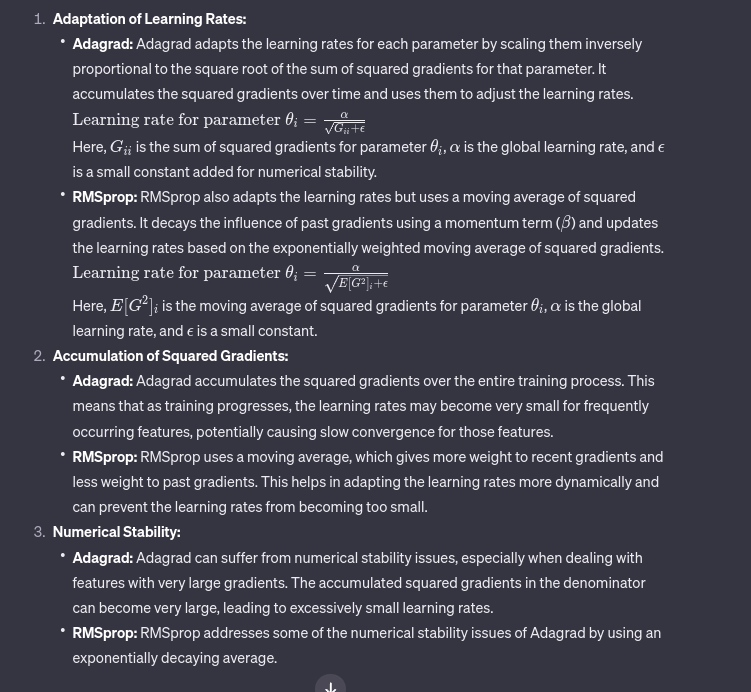

## Adam ?

Adam can be looked at as a combination of RMSprop and Stochastic Gradient Descent with momentum. It uses the squared gradients to scale the learning rate like RMSprop and it takes advantage of momentum by using moving average of the gradient instead of gradient itself like SGD with momentum. Let’s take a closer look at how it works.
