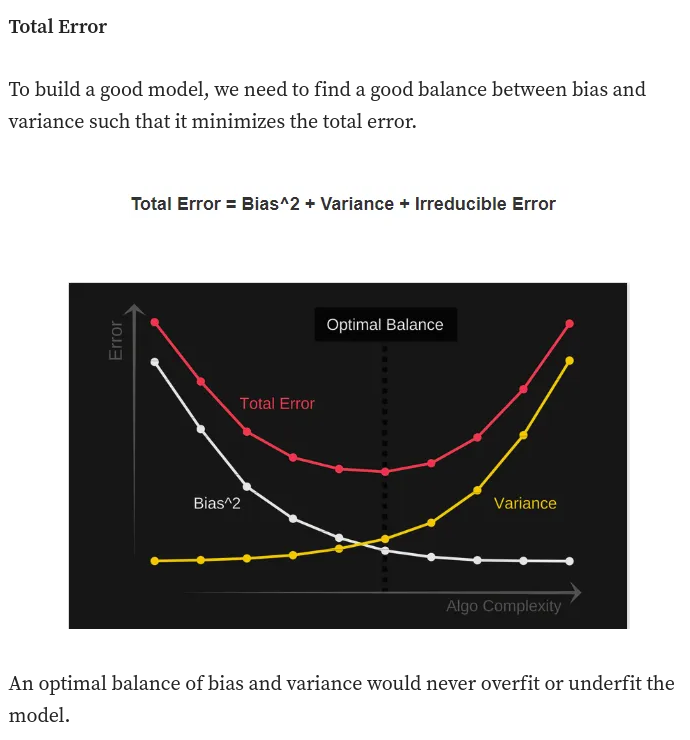
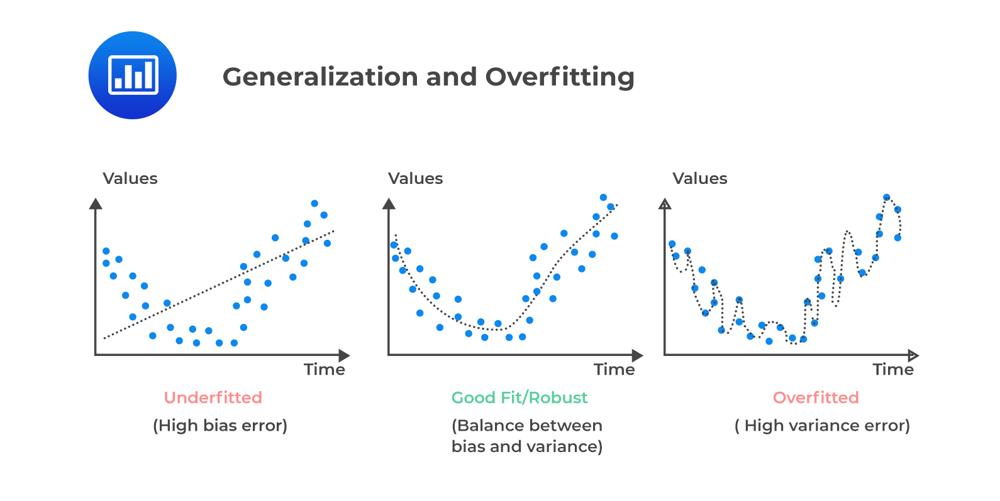

## What is the difference between parameter and hyper-parameter?

A hyper-parameter is a parameter that has to be chosen manually before training. The prefix ‘hyper-‘ is to differentiate hyper-parameter to the parameter that was changed automatically by the optimization algorithms during training. 

## Variance and bias  and what happen to them in overfitting and underfitting?

__Variance__ refers to the model's sensitivity to fluctuations in the training data. It measures the extent to which the model's predictions would change if the algorithm were trained on a different dataset. A high variance indicates that the model is too complex and has learned the training data too well, including its noise and fluctuations.

__Bias__  It is the difference between the predicted values by the model and the true values in the training set.

__Bias Variance tradeoff

