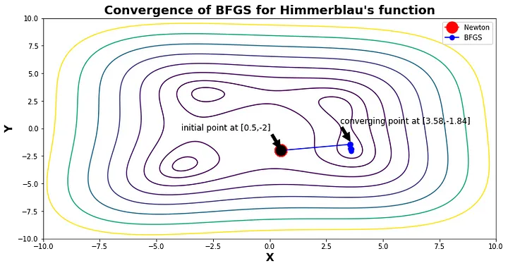
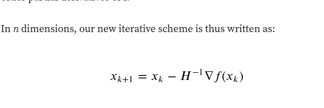
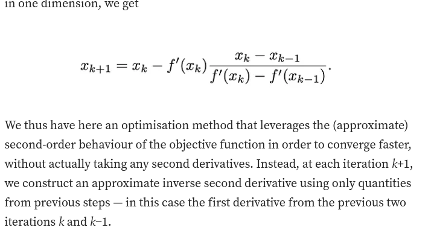

## 1) Newton method for calulcation the minima worls faster then why we dont use it instead of stocastic(Vanilla) Gradient descent

__Highly sensitive to initial conditions__
 -> See in the above image : Here the Newton’s method fails to converge(as shown by the red dot) to the minima when the starting point is (0.5, -2) but BFGS (a mystery method for now) converges to one of the minima successfully. It is therefore difficult to choose the intial points so that the Newton’s method converges. Especially true for a non-convex model would be neural networks. For the rest of this article, we will restrict our attention to only convex objective functions.
__Positive Definite Hessian__
    -> if the hessian is not positive definite the update may increase the objective function value.Correspondingly, we require the Hessian to be positive definite.
__Computationally expensive__
    ->As the dimensions of our problem increases, the overhead in memory and time gets out of hand very quickly. For example, in 50 dimensions, we’ll have to calculate 50(50+1)/2 = 1275 values for the Hessian at each step, and then perform approximately another (53*2500) operations to invert it. It’s clear at this point that the benefit of an increased convergence rate will be far outweighed by the large cost of the additional computation time. (computing the Hessian scales as O(n²), inverting it scales as O(n³))

### Newton Method?

### Quasi-Newton Method?

### why we do not use quasi newton method rather than stocastic gradient descent?

#### Memory Requirements:

- Quasi-Newton methods, like BFGS, maintain an approximation of the Hessian matrix, which can be computationally expensive in terms of memory.
- In SGD, each update is based on a small subset of data, and maintaining the full Hessian matrix may not be practical due to the potentially large dataset size.

#### Computational Complexity:

- Quasi-Newton methods involve the inversion of the Hessian matrix or its approximation, which has a cubic time complexity in the number of parameters.
- In the context of deep learning, neural networks often have a large number of parameters, making the computational cost of these methods prohibitive, especially for online learning scenarios.

#### Stochastic Nature of SGD:

- The stochastic nature of SGD, where gradients are computed on small random subsets of data, introduces noise into the optimization process.
- The assumptions made by quasi-Newton methods about smooth and deterministic gradients are violated in the stochastic setting, potentially leading to suboptimal performance.

#### Adaptability to Online Learning:

- Quasi-Newton methods are designed for batch optimization, where the entire dataset is available at each iteration.
- SGD is well-suited for online learning scenarios, where data arrives sequentially or in mini-batches, making it more adaptable to real-time updates and large-scale datasets.

#### Regularization Techniques:

- Modern deep learning often involves the use of regularization techniques, such as dropout or weight decay, which can affect the curvature of the loss landscape.
- The effectiveness of quasi-Newton methods relies on certain smoothness assumptions that may not hold in the presence of regularization.

