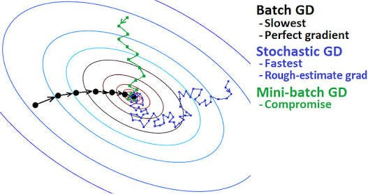

# Possible Questions

## 1) What are the differences in terms of the number of updates to model parameters during 10 epochs when using stochastic gradient descent (SGD), mini-batch gradient descent, and batch gradient descent, and how does the choice of algorithm impact the training process over these 10 epochs?

### ans)

<!--  make it bold -->
 #### Batch Gradient Descent:( vanilla gradient descent )

-> In batch gradient descent, the entire training dataset is used to compute the gradient of the cost function with respect to the model parameters.
-> The model parameters are updated once per epoch (a full pass through the entire training dataset). 
-> 10 epochs -10 times parameter update

#### Stochastic Gradient Descent (SGD):
In stochastic gradient descent, the model parameters are updated after each individual training example.
it's called "stochastic" because the updates are noisy and can fluctuate based on the randomness inherent in using individual data points.
-> 10 epoch- X.size()*(10)

#### Mini-Batch Gradient Descent:
Mini-batch gradient descent strikes a balance between batch and stochastic gradient descent. It divides the training dataset into small batches (typically of size 32, 64, 128, etc.), and the model parameters are updated after processing each mini-batch.
10 epochs - (x.size()/batch_size)*10

